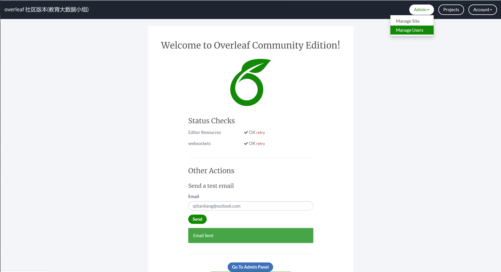

# overleaf 社区版本
* 支持完整版texlive
* 支持中文排版
* 支持交大论文latex模板

# 管理员配置教程
## 配置思路

服务器 + [docker](https://docs.docker.com/get-docker/) + [docker-compose](https://docs.docker.com/compose/install/)

基于docker构建sharelatex(overleaf 社区版本) + texlive + extra fonts 镜像，结合[overleaf官方](https://github.com/overleaf/overleaf)给出额外的`docker-compose.yml`进行替换对应的sharelatex基础镜像，构建运行在自己服务器上的overleaf社区版本。

## 配置文件

* `Dockerfile` 满足texlive和中文排版的镜像构建文件

具体说明：


```
# overleaf 开源版本镜像
FROM sharelatex/sharelatex:2.5.0
```
上述片段是sharelatex镜像版本，详细见[可用版本](https://hub.docker.com/r/sharelatex/sharelatex/tags?page=1&ordering=last_updated)，教程为2.5.0。


>如何添加window10中文字体库见 Readme


可以将`C:\Windows\Fonts`中字体直接拷贝到服务器当前`fonts`文件夹
如果你window系统装有git bash 可以直接使用scp 指令进行拷贝,如下：

```
scp -r /c/Windows/Fonts/* user@host:/current/path/fonts
```

因为`*.fon`会在build 过程中获取字体full name失败，可以选择删除(不删也可以build通过)

```
# ./fonts
rm -rf *.fon
```

* `docker-compose.yml` 配置服务所需目录和端口

具体说明(相比官方改动)：

|docker-compose-official.yml|docker-compose.yml|说明|
|----|----|----|
|image: sharelatex/sharelatex|build: .|使用本地Dockerfile build 新镜像 |
|80:80|port:80|port 为服务所占用的服务器端口|
|<p># SHARELATEX_SITE_URL: http://sharelatex.mydomain.com<br># SHARELATEX_NAV_TITLE: Our ShareLaTeX Instance<br># SHARELATEX_HEADER_IMAGE_URL: http://somewhere.com/mylogo.png<br># SHARELATEX_ADMIN_EMAIL: support@it.com<p>|<p>SHARELATEX_SITE_URL: http://ip:port<br>SHARELATEX_NAV_TITLE: overleaf 社区版本(教育大数据小组)<br># SHARELATEX_HEADER_IMAGE_URL: http://somewhere.com/mylogo.png<br>SHARELATEX_ADMIN_EMAIL: qitianliang@outlook.com<p>|ip服务器ip,如果有域名可以是域名，overleaf社区版服务端口，同上文port；加入自定义的内容。管理员运维邮箱，便于他人邮箱申请，overleaf服务和更改密码；注意一些配置删除了注释符`#`|
|# SHARELATEX_EMAIL_FROM_ADDRESS: "team@sharelatex.com"|SHARELATEX_EMAIL_FROM_ADDRESS: "qitianliang@outlook.com"|管理员运维邮箱,同上|
| <p># SHARELATEX_EMAIL_SMTP_HOST: smtp.mydomain.com<br># SHARELATEX_EMAIL_SMTP_PORT: 587<br># SHARELATEX_EMAIL_SMTP_SECURE: false<br># SHARELATEX_EMAIL_SMTP_USER:<br># SHARELATEX_EMAIL_SMTP_PASS:<br># SHARELATEX_EMAIL_SMTP_TLS_REJECT_UNAUTH: true<br># SHARELATEX_EMAIL_SMTP_IGNORE_TLS: false<br># SHARELATEX_CUSTOM_EMAIL_FOOTER: "This system is run by department x"<p>|<p>SHARELATEX_EMAIL_SMTP_HOST: smtp.office365.com<br>SHARELATEX_EMAIL_SMTP_PORT: 587<br># SHARELATEX_EMAIL_SMTP_SECURE: "STARTTLS"<br>SHARELATEX_EMAIL_SMTP_USER: qitianliang@outlook.com<br>SHARELATEX_EMAIL_SMTP_PASS: my-email-password<br>SHARELATEX_EMAIL_SMTP_TLS_REJECT_UNAUTH: "true"<br>SHARELATEX_EMAIL_SMTP_IGNORE_TLS: "false"<br>SHARELATEX_CUSTOM_EMAIL_FOOTER: "This system running for education big data group"<p>|配置管理员邮箱服务，用于注册和修改密码，例程是outlook邮箱配置，具体的SMTP请搜索`**邮箱SMTP配置`|
|~/sharelatex_data:/var/lib/sharelatex|/host/path/sharelatex:/var/lib/sharelatex|冒号左边为持久化数据（用户文档，用户管理后台数据）目录，official方式会创建在`/home/user/`目录下|
|~/mongo_data:/data/db|/host/path/mongo_data:/data/db|冒号左边为持久化数据（用户文档，用户管理后台数据）目录,official方式会创建在`/home/user/`目录下|
~/redis_data:/data|/host/path/redis_data:/data|冒号左边为持久化数据（用户文档，用户管理后台数据）目录，official方式会创建在`/home/user/`目录下|

以上对比内容需要管理员核对需要填写成合适的值。

## 启动服务

> 最好熟悉docker-compose简单指令


```
docker-compose up --build -d
```
> 第一次运行后，管理员浏览器访问ip:port/launchpad,填写admin邮箱（与配置中的邮箱一致）及登陆密码，创建后核验给邮箱发邮件能够成功，就可以将连接共享给你的小伙伴让他们注册使用了。不成功检查一下SMTP设置是否有问题。


小伙伴给你的邮箱发邮件，你可以直接按照邮箱地址创建用户，之后大家可以愉快的使用。



## 关闭服务
```
docker-compose up down
```

## 西安交通大学论文latex

[论文latex模板](http://gs.xjtu.edu.cn/info/1209/7605.htm)

下载下来，解压缩，重新压缩成zip,即可上传到overleaf上

选定配置xelatex即可享用。


教育大数据同学直接给我邮箱发邮件<qitianliang@outlook.com>即可使用。